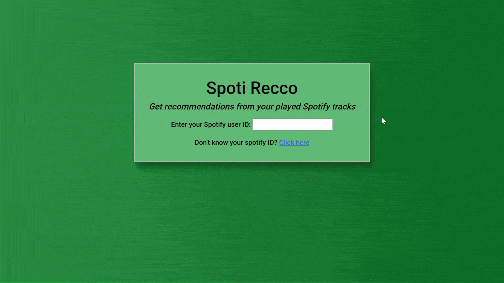
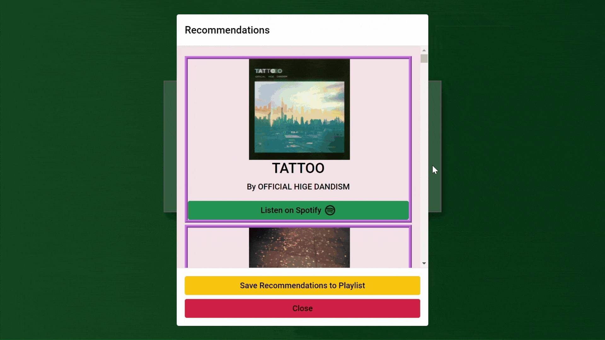
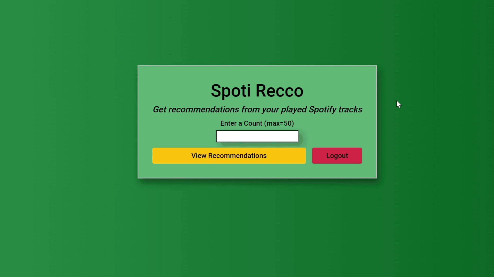

# Spotify Track Recommendation App using Python
This application provides personalized track recommendations by analyzing users' recently played tracks on Spotify. 
It identifies the most frequented music genre and generates a playlist based on the top genre.

## Technologies Used
* Backend: Python with Flask Framework
* Frontend: Javascript, HTML with CSS and Bootstrap 5
* API Integration: Spotipy
* Templating: Jinja

## Features
### User login
User login utilizes the Spotify's Authorization Code Flow, which ensures that first-time users grant app permissions only once.
The access token is checked for subsequent login attempts and refreshed for expired tokens in order to re-authenticate the user to the app.

### Main Page
Users can input a fixed number (1-50) which represents the count of their recently played tracks they wish to analyze for genre patterns. Based on this analysis, the app will generate a playlist. Users can also choose to log out from the app.

### Playlist Generation
Generates a custom playlist based on the user's top genre.
Users can view each individual track on Spotify.

### Save Playlist
Users can choose to name and save the playlist directly to their Spotify account.

### User logout
Users are directed to the Spotify Logout Page during the logout process, which terminates the Spotify session in their browser.
An AJAX request is also initiated by the app right after redirection for managing post-logout actions. Upon successful completion of this request, the home page is redirected back to the login page.
